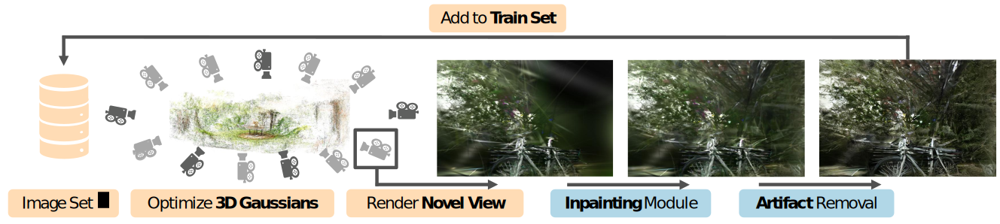
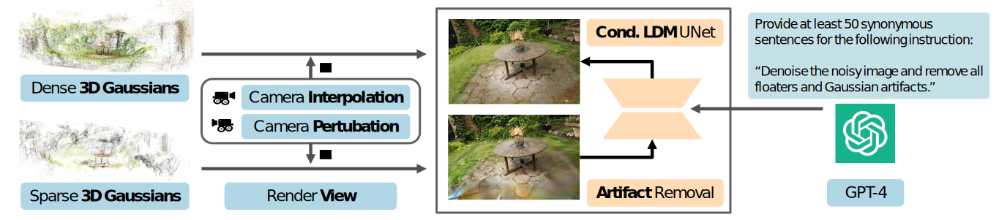

<p align="center">
<h1 align="center">
Sp<sup>2</sup>360: Sparse-view 360&deg Scene Reconstruction using Cascaded 2D Diffusion Priors
</h1>

<p align="center">
<a href="https://mvp18.github.io"><strong>Soumava Paul</strong></a>
·
<a href="http://geometric-rl.mpi-inf.mpg.de/people/Wewer.html"><strong>Christopher Wewer</strong></a>
·
<a href="https://www.mpi-inf.mpg.de/departments/computer-vision-and-machine-learning/people/bernt-schiele"><strong>Bernt Schiele</strong></a>
·
<a href="https://janericlenssen.github.io/"><strong>Jan Eric Lenssen</strong></a>
</p>

<h3 align="center">
<a href="https://arxiv.org/abs/2405.16517">Arxiv preprint</a>
</h3>
</p>




### Dataset

Our experiments are based on the MipNeRF360 benchmark available [here](http://storage.googleapis.com/gresearch/refraw360/360_v2.zip) and [here](https://storage.googleapis.com/gresearch/refraw360/360_extra_scenes.zip). Download and put the dataset under `data/360_v2` in the root directory.

### Implementation

Currently the repository only has functionalities for our view selection algorithm outlined in A.1. The full implementation of the method will be released soon.

To sample an M-view subset from a given multiview set, run:

```
python -m utils.view_splits --source_path data/360_v2/<scene>/<scene>_train --test_cams data/360_v2/<scene>/<scene>_test --num_eval_views M  --eval
```

where `<scene>` ∈ {bicycle, garden, flowers, stump, treehill, room, counter, kitchen, bonsai}.

### 🎓 Cite

If this code was helpful for your research, consider citing:

```bibtex
@article{paul2024sp2360,
          title={Sp2360: Sparse-view 360 Scene Reconstruction using Cascaded 2D Diffusion Priors},
          author={Paul, Soumava and Wewer, Christopher and Schiele, Bernt and Lenssen, Jan Eric},
          journal={arXiv preprint arXiv:2405.16517},
          year={2024}
}        
```